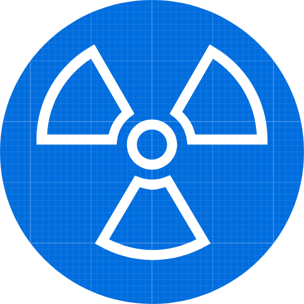
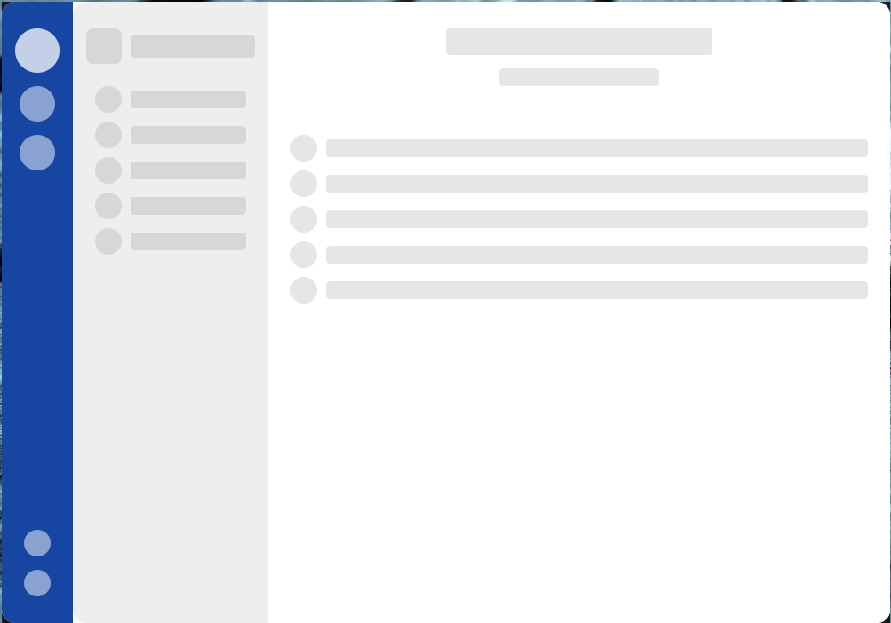

  

## QuickTk
*Current in Trash-stage*

### Description
The main goal of the project is to create a simple component-based GUI Toolkit for developing beautiful and user-friendly interfaces.

Cross-Platform GUI toolkit for Rust language based on:
- Webrender - as render system
- Yoga - for layout management
- RSX - for templates and styles

### Screenshot of current status

  

### Disclaimer
The project is developed by an amateur, with the support of other amateurs - from the Russian Rust community.
